## Hi, I'm Jason Lyu

An open-source developer who codes for fun.

- [My gadgets](https://github.com/xjasonlyu?tab=repositories)
- [About me](https://12x.me/about/)

Also available at:

- [Twitter](https://twitter.com/xjasonlyu)
- [Telegram](https://t.me/xjasonlyu)

Languages and Tools:

<code></code>
<code></code>
<code></code>
<code></code>
<code></code>
<code></code>
<code></code>
<code></code>
<code></code>
<code></code>
<code></code>
<code></code>
<code></code>
<code></code>
<code></code>
<code></code>
<code></code>
<code></code>
<code></code>
<code></code>
<code></code>
<code></code>
<code></code>
<code></code>
<code></code>
<code></code>
<code></code>
<code></code>
<code></code>
<code></code>
<code></code>
<code></code>
<code></code>
<code></code>
<code></code>
<code></code>

**GitHub Stats**:

